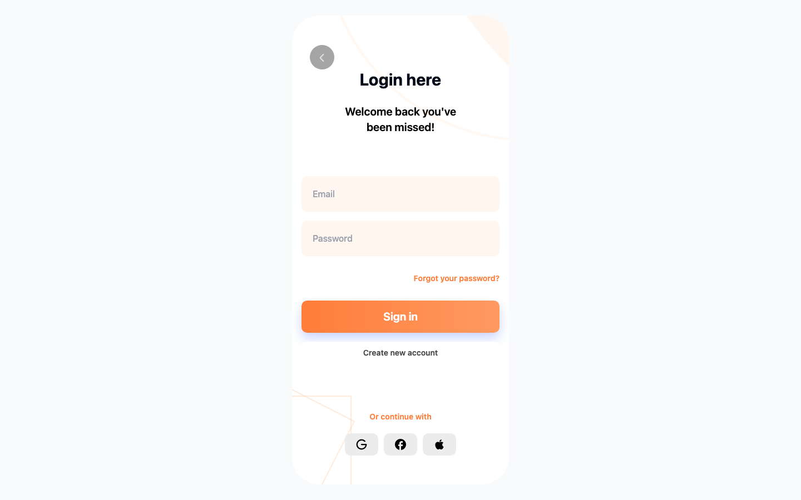

# Offbeats — Login UI Prototype

An early, single-screen UI prototype (mobile-frame login screen) built while exploring the [Offbeats](https://github.com/yogixt/offbeat1.2) travel app concept.

**Live:** [p-268330.vercel.app](https://p-268330.vercel.app)



## Stack

- React · TypeScript · Vite · shadcn/ui · Tailwind CSS

## Development

```bash
npm install
npm run dev
```
